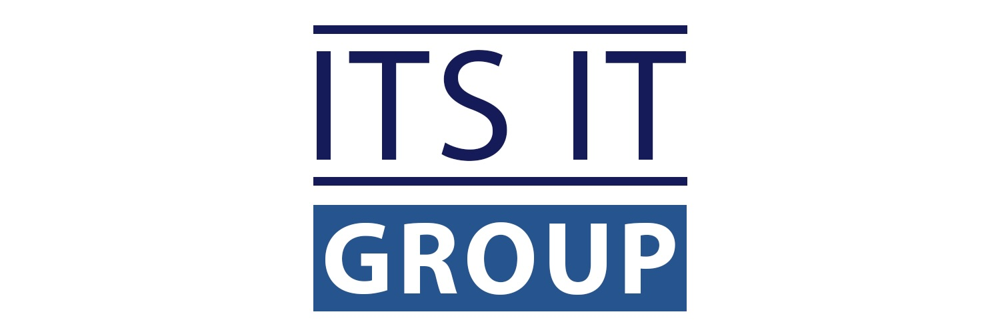

<!--  Replace with your actual logo URL -->

  

# Welcome to Its IT Group

Its IT Group is a dynamic and forward-thinking IT services and solutions provider specializing in cutting-edge technologies such as AI/ML, Stable Diffusion, LLMs, Backend & App Development, and Cloud Computing. Our expertise lies in developing Computer Vision applications, custom ChatBots, and the integration of Stable Diffusion on the backend of websites or apps. We also excel in creating cloud-native applications and continually expand our service offerings to stay at the forefront of technological advancements.

## Our Expertise

### Artificial Intelligence and Machine Learning
- **AI/ML Solutions**: We develop and deploy AI and ML models tailored to your business needs.
- **Stable Diffusion Integration**: Seamless integration of Stable Diffusion models into websites and apps.
- **LLMs (Large Language Models)**: Custom solutions using the latest advancements in natural language processing.

### Computer Vision
- **Computer Vision Applications**: Advanced solutions for various industries, including retail, healthcare, and security.
- **YOLO-based Projects**: Expertise in developing intermediate and advanced projects using YOLO for object detection.
- **Meta Segment Anything Model 2 (SAM2)**: Deployment of SAM2 for video segmentation and tracking, enhancing video analysis capabilities.

### Backend and App Development
- **Backend Development**: Robust backend solutions using Django, Flask, and other frameworks.
- **App Development**: 
  - **iOS Development**: Proficient in Swift, SwiftUI, UIKit, ARKit, and RoomPlan API.
  - **Cross-platform Apps**: Development of apps with seamless user experiences on multiple platforms.

### Cloud Computing
- **Cloud-native Applications**: Development and deployment of applications on AWS, Azure, and Google Cloud.
- **DevOps Practices**: Implementation of CI/CD pipelines, automated testing, and deployment strategies.

## Our Services

### Custom ChatBots
- Development of intelligent chatbots for customer service, sales, and more.

### Dedicated Offshore Teams
- Setup and management of dedicated teams tailored to your project needs.
- Facilitating new hires and ensuring teams work within your time zone for optimal communication and project focus.

### AR and RoomPlan API
- **ARKit Solutions**: Building immersive augmented reality experiences.
- **RoomPlan API**: Developing applications using Apple's RoomPlan API for accurate room modeling and cost estimation.

## Our Mission
Our mission is to empower businesses of all sizes by providing them with the technological tools they need to thrive in today's digital landscape. We serve a diverse range of clients, allowing them to outsource their tech needs to our skilled and dedicated team. What sets us apart is our commitment to staying up-to-date with the latest technologies and our ability to deliver AI and ML-intensive solutions that our competitors can't match.

## Vision
As a new company based in Pakistan, we have quickly established a culture that values education, support, and mutual encouragement. While we focus on serving clients in our local area, our vision is to expand our reach and work with clients globally.

At Its IT Group, we're not just about providing services but about creating value, driving innovation, and making a lasting impact. We're tech-powered, value-driven, and excited to help your business achieve its full potential.

## Connect with Us
Stay updated with our latest projects and offerings:
- [Website](https://www.itsitgroup.com/)
- [LinkedIn](https://www.linkedin.com/company/its-it-group)

Thank you for visiting our profile. Let's innovate together!